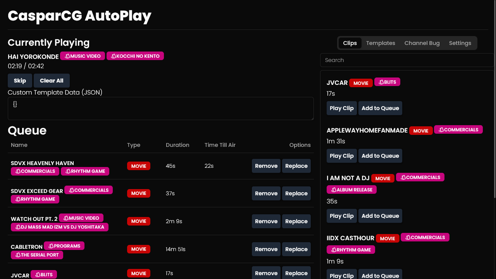

# CasparCG-Autoplay

CasperCG Autoplay connects to CasparCG, grabs the Media List, and plays your Programs and media automatically, without user intervention.



## Running the Program

> **_Important:_** CasparCG-Autoplay Assumes you have sorted your media into folders, as CasparCG-Autoplay uses these folders as the basis of it's tag and Advanced Autoplay System.
> 
> Additionally, CasparCG-Autoplay makes use of regex's to grab the catagory and tags using a default format of `programs/artist - name - tag1 - tag2.mp4`. you are able to add as many tags as you want.
> 
> These settings, including changing the Regex entirely to your own custom naming scheme is possible under the `Settings` Tab.

Install the dependancies using `npm install`, and ensure that both `casparcg.exe` and `scanner.exe` are running.

Then, Start it up using the following command.
```bash
npm run dev

# or, to start the server and open the app in a new browser tab
npm run dev -- --open
```

You'll need to make new folders with CasparCG-Autoplay in them if you wish to utilize more then one channel at once.

## Compatibility

You may run into some issues if you already use [Superconductor](https://github.com/SuperFlyTV/SuperConductor), or any similar program to control CasparCG, if both CasparCG-Autoplay and any other program that can interface with CasparCG utilize the same layer.

Ensure that CasparCG-Autoplay and what ever other programs you are using are not conflicting Layer wise.

The ability to change what channel and layer CasparCG-Autoplay utilizes is avalible within the `Settings` Tab.

## Tipping

If you want to support me, and motivate me to work on this project more, consider donating.

(GalexionLink Stripe)[https://donate.stripe.com/4gw8yv8DMfAY0Ra000]
(Galexion's Liberapay)[https://liberapay.com/Galexion/]

Thank you!